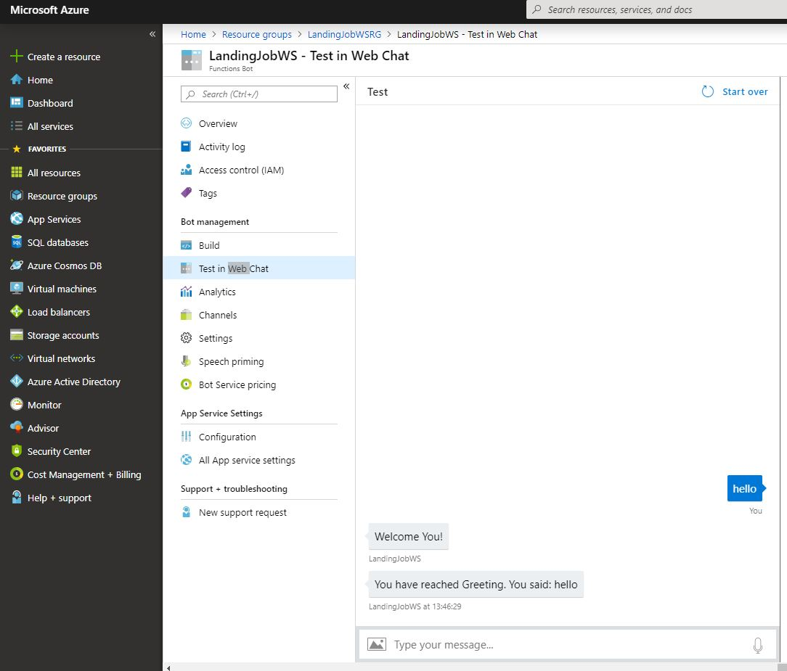

## Adding inteligence to a simple bot

We're going to start with a simple bot and just start adding stuff to it - LUIS

## We'll start preparing the bot

First Create a function bot in [azure](https://portal.azure.com/)

**Remember to use the LUIS template create bot**

You can test it directly in the web chat, it's using a common LUIS

Now, let's [Create an Intent](https://github.com/xpandit/landingjobs_cognitiveservices/blob/master/CreateIntent.md)