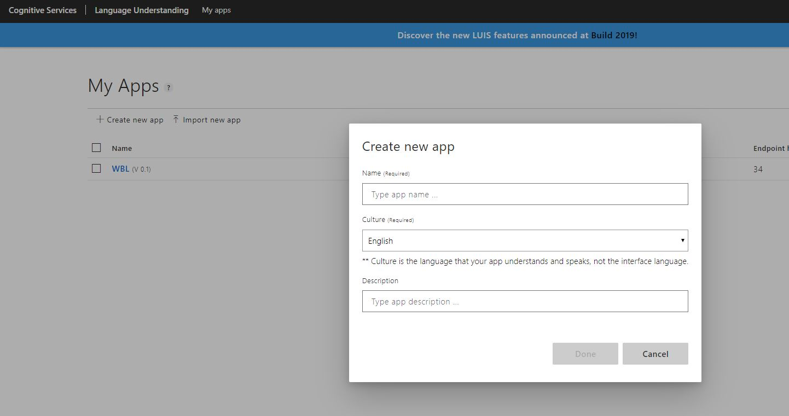
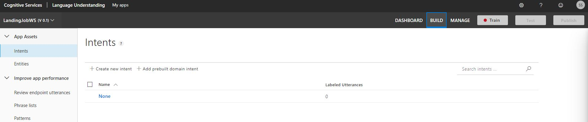
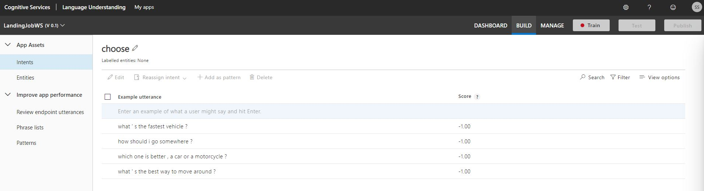
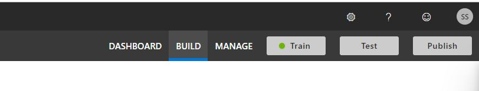
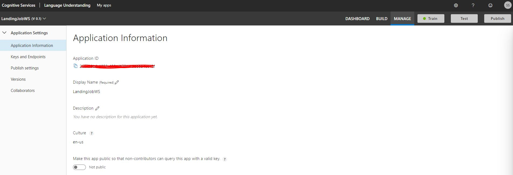
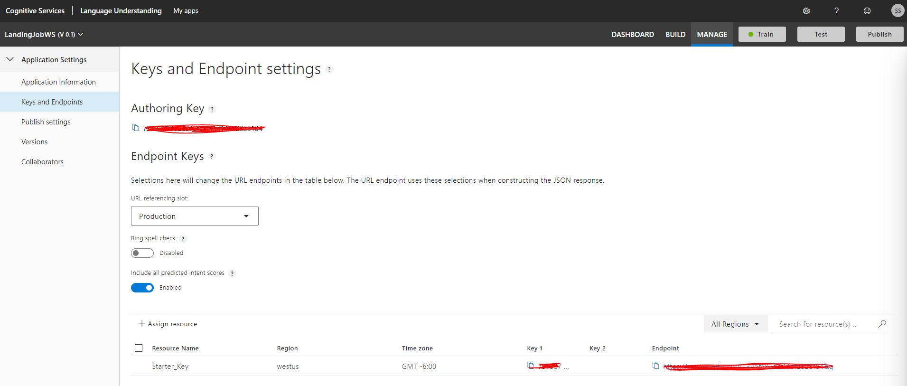
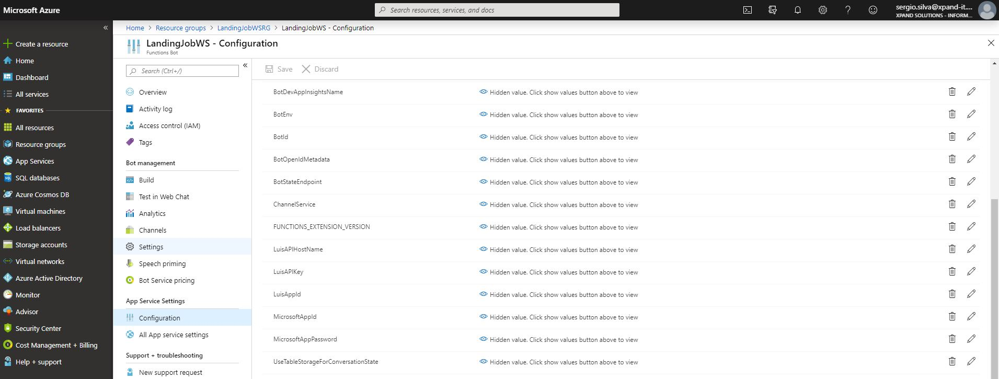
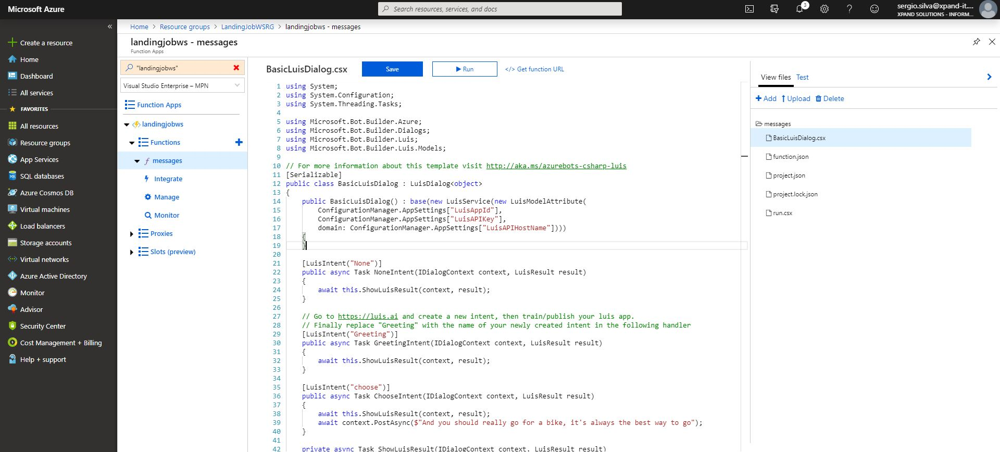
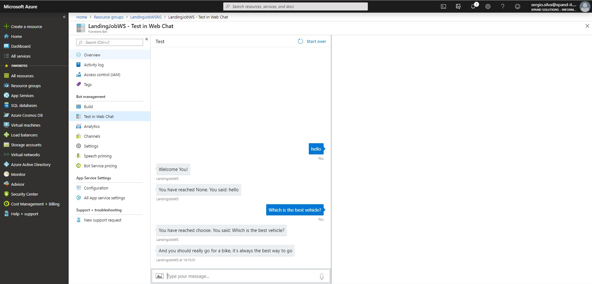

# Let's prepare our bot to help us out choosing a means of transportation

So that we can ask him what's best for us to commute A bot is dialog driven, so let's begin by thinking which Actions we want to take and we'll start working from there On this Lab we'll focus on 2 different actions:

* Which type of vehicle is preferable for me : choose
* Which should we use in a given day (let's start lookin at entities also) : choosewhen

## Let's create a LUIS instance

Let's go to [LUIS](https://www.luis.ai) and create a new app (call it whatever you'd like)

Now, let's prepare some intents, with some utterances for the first one and start giving him utterances:

* what's the best way to move around?
* which one is better, a car or a motorcycle?
* how should i go somewhere?
* what's the fastest vehicle?

### Now, first train your App, then Publish it to get an endpoint

it will take a while top right

### Go to LUIS "Manage" and get the keys for your endpoint:

* get the app info app information

* get the endpoint endpoints

### Get back to the bot Application Settings and change these settings:

* app settings

## Now let's use it

Go to the function and change the BasicLuisDialog.csx so that we are ready for this new intent:

here's an [example](exercises/ex1/BasicLuisDialog.csx)

and try it! talk to him and keep training

let's create a new [intent](https://github.com/xpandit/landingjobs_cognitiveservices/blob/master/CreateIntentWithEntity.md) that has an entity