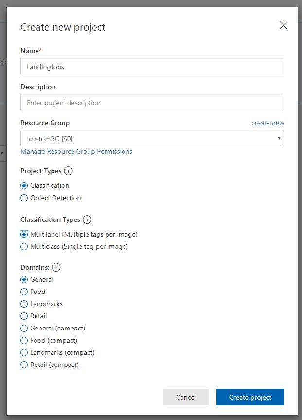
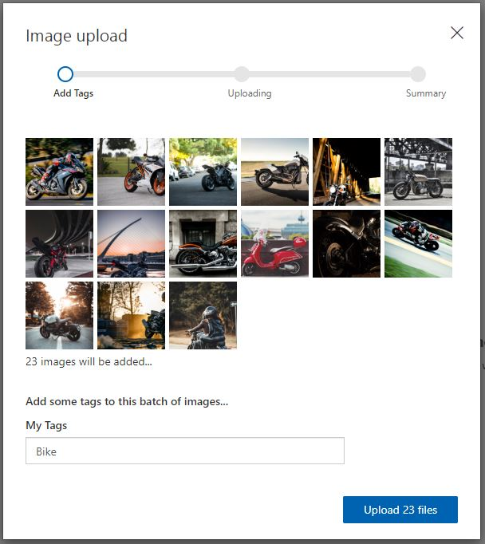
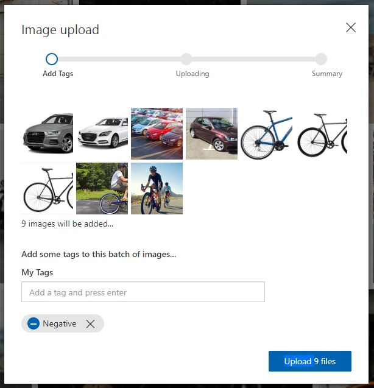
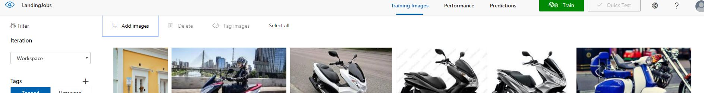
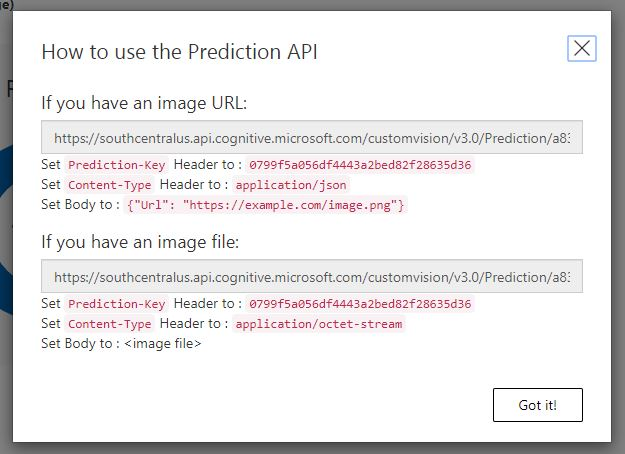
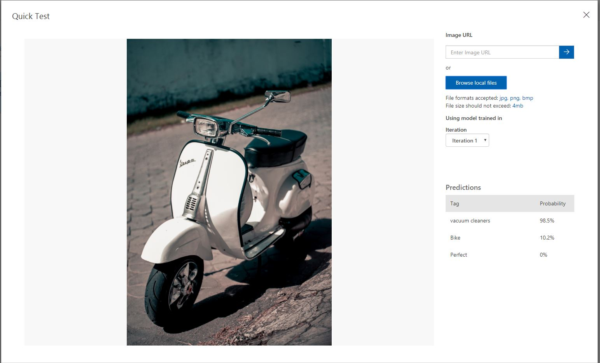

# Creating a custom vision
Lets go to [https://customvision.ai](https://customvision.ai)

Create a new project for bike classification

## Let's train it first
We'll have 4 tags:
- Negative - we always need negatives
- bike
- perfect!
- vacuum cleaner

We have different sets of images, one for each, upload for each tag

## Trains the model

## after training, review performance

## and get the prediction URL

## Test the Model

