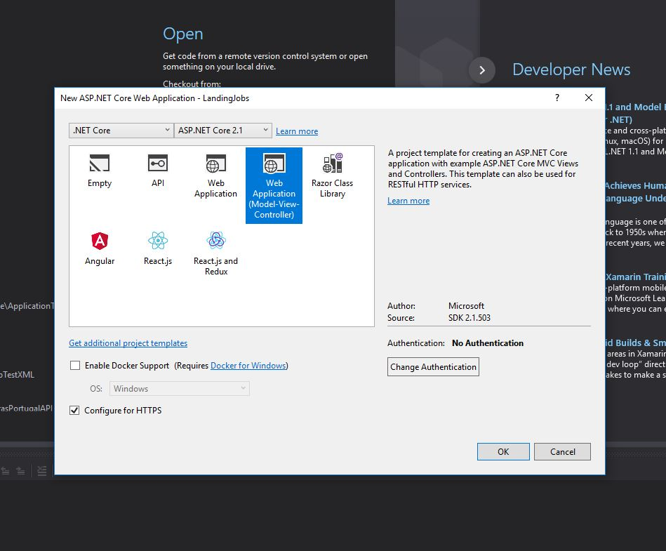
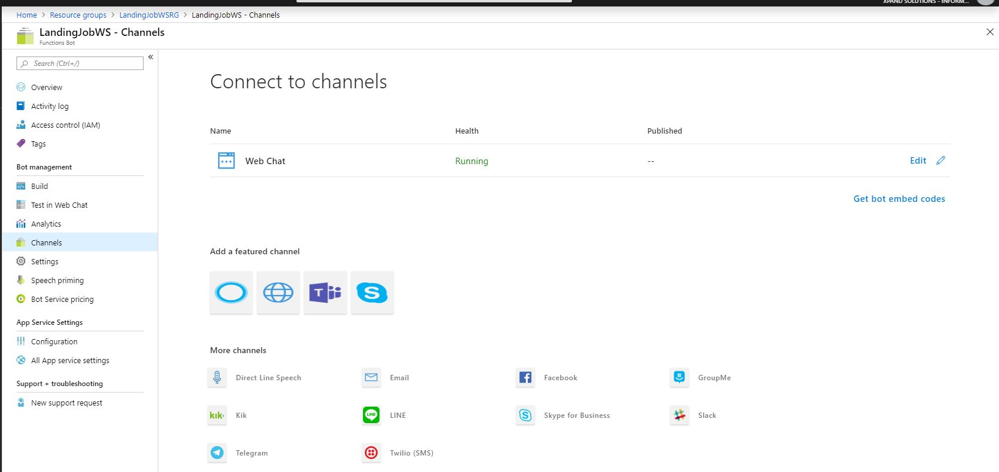
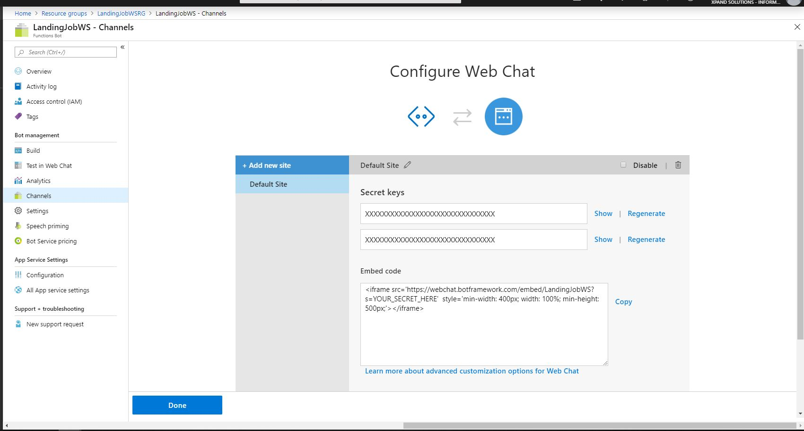
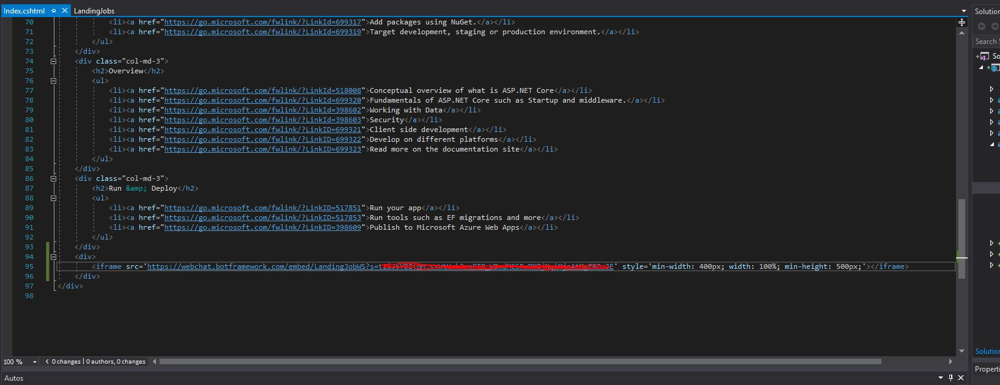
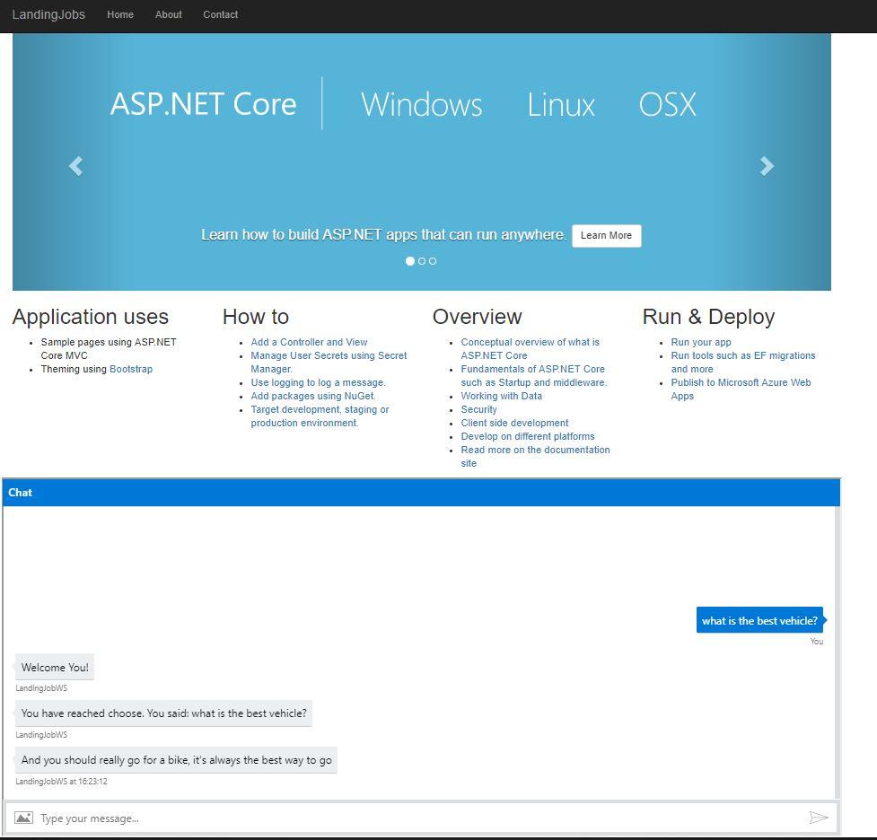

# Now let's integrate Function bot with Web app

## Create a Web Application

## Get the embed code to be added to the web app

First go to the channels in the function bot. Select the Web Chat

In the edit of this channel, copy the embed code and also, the secrets key

Go back to your Web App, and add the embed code to the index. In the embed code add the secret code.

s
Build and test the bot

Now Let's try to use custom vision [Custom Vision](https://github.com/xpandit/landingjobs_cognitiveservices/blob/master/CustomVision.md).
