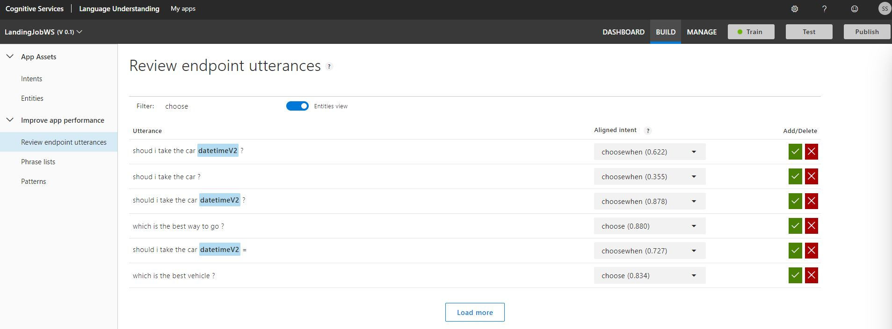

# Now for the review of the utterances

The Luis allow us to check the utterances received. Also allow to change the intent associated with the utterance. Helping the Luis to get better results

Check your utterance and see if there is any utterrance that you want to change the intent.

How Amazing it would be if we integrate our bot with our Web App, it's possible let's try [Integrate with Web Application](https://github.com/xpandit/landingjobs_cognitiveservices/blob/master/IntegrateWithWebApp.md)